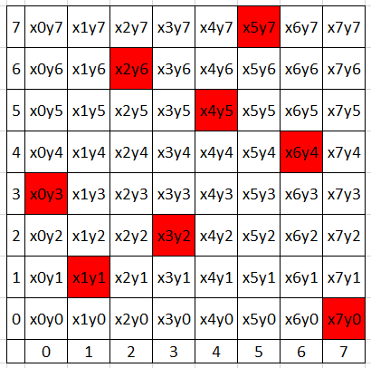

# APL - Assignment n°2

*By Arthur ADAM and Robin LOTODE*

**Please not that every file mentioned in this PDF file is provided in the Canvas Submission.**

## Part 1 - 8queens Problem

This problem is a simple problem. The 8queens problem takes places on a 8x8 chessboard.

***8 queens*** should be placed in a manner that no two queens can attack each other.

### SMT2 Generator

The first thing we've done was creating a `SMT2 8queen Generator` since we saw a first implementation of the 4queens problem in SMT2.

We've developed a 8queen SMT2 Generator in the file "assignment2_1_generator.py" that print a SMT2 file in a terminal. It will writes the clauses and the variables declarations.

### 8Queen Problem Solving

Using the generator above, we can have the "assignment2_1.smt2" (file submitted with this PDF) SMT2 input file for Z3.

In this file, we choose to create 64 variables; one for each cell of the 8x8 chessboard.

Then, we had to check:

- That one queen can land in each diagonal
- That one queen can land in one column
- That one queen can land in one line

Finally, we just have to check the satisfiability of the file and get the result model of the input.

### 8queen Problem Output

The following file provides the output in the file "assignment2_1_output.txt" (Provided with this PDF).

In other words, the following result can be transposed into this image using Excel for example:



## Part 2 - 7 Medecines for 7 rounds

This problem is the following:

- We have 7 medecines and we are planing to test those medecines.
- 7 test rounds are prepared.
- In each round, exactly 3 different medecines should be tested.
- For a given pair of medecine, there should be only one test round where they both appear.

This problem has been done without a generator.

### Problem Solving

The following problem can be solved using the "assignment2_2.smt2" (file submitted with this PDF).

In this file, we choose the following method:

- Since we are working with pairs, let's create a datatype for pairs.
- Next, we're creating as much pairs as we can encounter in 7 rounds. Each pairs are made of 2 elements and each 3 pairs are constructed for the 3 different medecines for each round.
- Finally, since SMT2 and Z3 can't say that pair (1, 2) is the same as (2, 1), we're creating "reversed" pairs to check if all pairs are unique.

We are first creating the pairs, then we're putting values between 1 and 7, each number representing one medecine, inside the pairs.

Pairs are created in order to make the following schematic true: (1, 2, 3) => (1, 2) + (1, 3) + (2, 3)

When this is done for each of the 7 rounds, we just have to create the reversed pairs and check if they all are unique.

If they aren't that means, there isn't any solution to that problem. Otherwise, they is a solution to that problem since each pair is unique.

Finally, we're getting the values of only the basic pairs.

### Problem Output

When using the input file you can find above, you will get the following output:

```rb
sat
((p1r1 (mk-pair 1 5))
 (p2r1 (mk-pair 1 2))
 (p3r1 (mk-pair 2 5))
 (p1r2 (mk-pair 5 7))
 (p2r2 (mk-pair 5 6))
 (p3r2 (mk-pair 6 7))
 (p1r3 (mk-pair 3 5))
 (p2r3 (mk-pair 3 4))
 (p3r3 (mk-pair 4 5))
 (p1r4 (mk-pair 1 3))
 (p2r4 (mk-pair 1 6))
 (p3r4 (mk-pair 6 3))
 (p1r5 (mk-pair 2 7))
 (p2r5 (mk-pair 2 3))
 (p3r5 (mk-pair 3 7))
 (p1r6 (mk-pair 2 6))
 (p2r6 (mk-pair 2 4))
 (p3r6 (mk-pair 4 6))
 (p1r7 (mk-pair 1 7))
 (p2r7 (mk-pair 1 4))
 (p3r7 (mk-pair 4 7))
)
```

In other words, we get the following tests rounds:

```txt
Round 1: 1-2-5
Round 2: 5-6-7
Round 3: 3-4-5
Round 4: 1-3-6
Round 5: 2-3-7
Round 6: 2-4-6
Round 7: 1-4-7
```

With this assignment, we have each pair of medecine unique.
