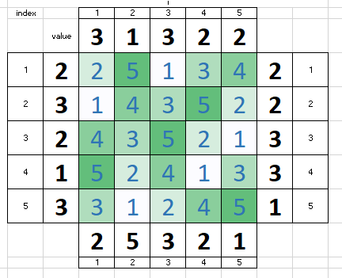

# APL - Assignment n°3

*By Arthur ADAM and Robin LOTODE*
**Please note that every file mentioned in this PDF is provided in the Canvas Submission.**

## Part 1 - Skyscrapers
This problem is a simple problem also called the "Simon Tatham's Puzzles". The goal is simple:
- This problem is a grid of 5x5.
- The goal of that problem is just like a sudoku, each row and column has unique values.
- Each row and column has constraints telling the number of skyscrapers you can see by looking at the direction.
	- For an example, if you're looking a row with constraints 5, the row should have all its cells to be in ascending order. If you have a column with 2, you must only see 2 skyscrapers:
		- 2 -> 25134 <- 2, on the left we only see 2 and 5. On the right, we only see 4 and 5.
		- 2 -> 35214 <- 2, on the left we only see 3 and 5 and so on.

### Skyscrapers Solving

In order to solve that program, we had to create the `skyscrapers.smt2` (file submitted with that PDF) as an input file.

In this file, we choose to create functions to keep our columns and rows states. We had to check that every cell also has a value between 1 and 5.

Then, we had to respect the different types of constraints that could be applied on the rows and columns (all clauses used for this are commented and are explicit in the input file).

Finally, when finishing making our clauses in our input file, we just had to check the satisfiability of the file and get the result model of the input.

### Skyscrapers Output

The following input file provides the following output:

```txt
sat
row1
(((cell 1 1) 2)
 ((cell 2 1) 5)
 ((cell 3 1) 1)
 ((cell 4 1) 3)
 ((cell 5 1) 4))
row2
(((cell 1 2) 1)
 ((cell 2 2) 4)
 ((cell 3 2) 3)
 ((cell 4 2) 5)
 ((cell 5 2) 2))
row3
(((cell 1 3) 4)
 ((cell 2 3) 3)
 ((cell 3 3) 5)
 ((cell 4 3) 2)
 ((cell 5 3) 1))
row4
(((cell 1 4) 5)
 ((cell 2 4) 2)
 ((cell 3 4) 4)
 ((cell 4 4) 1)
 ((cell 5 4) 3))
row5
(((cell 1 5) 3)
 ((cell 2 5) 1)
 ((cell 3 5) 2)
 ((cell 4 5) 4)
 ((cell 5 5) 5))
```

We also combined that output with a Excel sheet to visualise our result:



## Part 2 - Water Jugs
This problem is the following:
- We have 3 water jugs with the following capacities: 8 - 5 - 3
- At each step, we can pour the water from a jug from another until it reaches full capacity or until the jug we poured from is empty.
- We begin with the following capacities: 8 - 0 - 0
- At final state, we must have the following capacities: 4 - 4 - 0

We choose to write that assignment without a generator.

### Water Jugs Solving
In order to solve that program, we had to create the ``water_jug.smt2`` (file submitted with that PDF) as an input file.

In this file, we choose to create functions to state the water amount of our water jugs during any step

Then, we had to set up our initial and ending state.

Finally, when finishing our initial and ending state set ups, we just had to develop a function to execute the different mechanisms of water pouring. The comments for that part are really explicits and well documented.

### Water Jugs Output
The following input file provides the following output:

```txt
sat
((end_step 10)
 ((jugAtStep 0 1) 8)
 ((jugAtStep 0 2) 0)
 ((jugAtStep 0 3) 0)
 ((jugAtStep 1 1) 5)
 ((jugAtStep 1 2) 0)
 ((jugAtStep 1 3) 3)
 ((jugAtStep 2 1) 5)
 ((jugAtStep 2 2) 3)
 ((jugAtStep 2 3) 0)
 ((jugAtStep 3 1) 8)
 ((jugAtStep 3 2) 0)
 ((jugAtStep 3 3) 0)
 ((jugAtStep 4 1) 3)
 ((jugAtStep 4 2) 5)
 ((jugAtStep 4 3) 0)
 ((jugAtStep 5 1) 3)
 ((jugAtStep 5 2) 2)
 ((jugAtStep 5 3) 3)
 ((jugAtStep 6 1) 6)
 ((jugAtStep 6 2) 2)
 ((jugAtStep 6 3) 0)
 ((jugAtStep 7 1) 6)
 ((jugAtStep 7 2) 0)
 ((jugAtStep 7 3) 2)
 ((jugAtStep 8 1) 1)
 ((jugAtStep 8 2) 5)
 ((jugAtStep 8 3) 2)
 ((jugAtStep 9 1) 1)
 ((jugAtStep 9 2) 4)
 ((jugAtStep 9 3) 3)
 ((jugAtStep 10 1) 4)
 ((jugAtStep 10 2) 4)
 ((jugAtStep 10 3) 0))
```